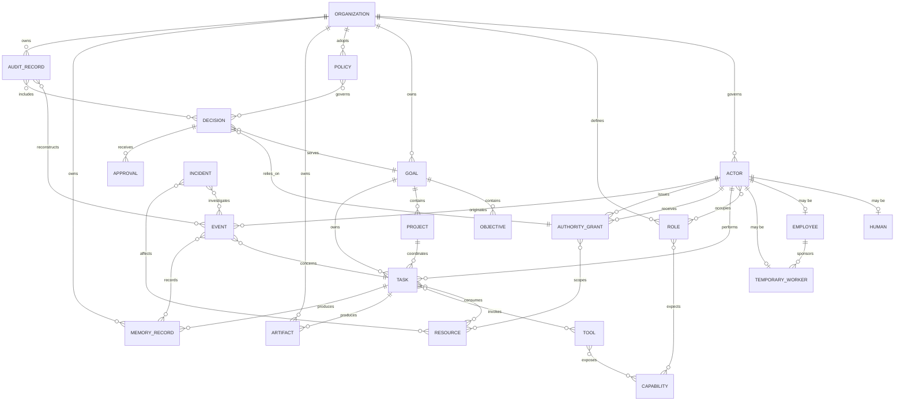

# AIOS Entity Model

**Specification version:** 0.0.2
**Status:** Normative kernel contract

## 1. Scope and conventions

This document defines the durable entities whose identities, relationships, and lifecycle changes the AIOS kernel must preserve. It refines the constitutional ontology without changing it. An implementation may add internal representations, but it must not weaken these semantics.

The keywords **MUST**, **MUST NOT**, **REQUIRED**, **SHALL**, **SHALL NOT**, **SHOULD**, **SHOULD NOT**, and **MAY** are normative.

Every entity has a globally unique, stable identifier. An identifier MUST identify exactly one entity for the lifetime of the AIOS installation, MUST NOT be reassigned, and MUST remain in audit references after archival, expiry, revocation, supersession, redaction, or deletion. A deletion tombstone is an entity reference, not the deleted content.

All entities have these common required attributes unless a definition explicitly narrows them:

- `id`: globally unique identifier of the entity-specific form named below;
- `organization_id`: owning or governing organization, except an Organization, whose value is its own `organization_id`;
- `created_at`: recorded creation time;
- `created_by_actor_id`: attributable creator;
- `lifecycle_state`: current state derived from events; and
- `version`: monotonically increasing logical version used for concurrency and audit references.

Common immutable fields are `id`, `organization_id`, `created_at`, and `created_by_actor_id`. Changes to mutable fields MUST occur through accepted commands and immutable events. References to evidence, policy, authority, approvals, and other entities are identifiers, never untracked embedded copies.

Organization bootstrap is the sole identity-ordering exception: an attributable, verified Human principal initiates creation, and the Organization plus that Human's organizational Actor identity are established atomically by the accepted bootstrap Command. The resulting `created_by_actor_id` references that Actor. No operational Command may occur between those creations, and bootstrap confers no authority beyond the Human-reserved creation Decision and the explicit Grants recorded with or after activation.

Ownership means constitutional control and accountability, not technical possession. Actors, including AI Employees and Temporary Workers, are members or agents of an Organization and never own organizational assets. A Human may legally own or govern an Organization. Where a lifecycle includes deletion, deletion means inaccessible content plus a lawful minimal tombstone; it never means rewriting event history.

## 2. Identity and organization entities

### Organization

- **Purpose:** Establish the sovereign governance, policy, asset, membership, and memory boundary.
- **Description:** A human-owned or lawfully governed unit operating under a declared mission and this Constitution.
- **Required attributes:** common attributes; `legal_or_operating_name`; `mission_record_id`; at least one `governing_human_actor_id`; `policy_ids`; `jurisdiction_scope`; `retention_policy_id`.
- **Optional attributes:** legal identity references; external identifiers; governing-body references; parent or affiliated organization references; dissolution terms.
- **Immutable fields:** `organization_id`, creation metadata. Legal identity changes MUST be represented by versioned records rather than identifier replacement.
- **Mutable fields:** name, mission reference, governance membership, policies, jurisdiction scope, metadata, lifecycle state.
- **Globally unique identifier:** `organization_id`.
- **Ownership:** Its human owner or legally constituted governing body. An Organization does not own itself.
- **Lifecycle state:** `proposed`, `active`, `suspended`, `dissolving`, `archived`, `deleted`.
- **Relationships:** governed by Humans; contains Actors, Roles, Goals, Projects, Policies, Resources, records, and Artifacts; adopts one current mission; emits and owns the authoritative event stream for its activity.

### Actor

- **Purpose:** Provide persistent attribution for every proposal, command, decision, and action.
- **Description:** An identifiable participant of kind `human`, `employee`, `temporary_worker`, or `service`. Actor identity is distinct from a model, session, credential, role, or tool.
- **Required attributes:** common attributes; `actor_kind`; `display_name`; `role_assignment_ids`; `accountability_contact_id`; `identity_status`.
- **Optional attributes:** external identity references; model-execution references; communication preferences; service attestation.
- **Immutable fields:** `actor_id`, `actor_kind`, organization membership, creation metadata. A change of kind creates a new Actor.
- **Mutable fields:** display metadata, role assignments, accountability contact, identity and lifecycle states.
- **Globally unique identifier:** `actor_id`.
- **Ownership:** The Organization governs the institutional identity; a Human retains ownership of their personal identity and rights.
- **Lifecycle state:** `invited` or `created`, `active`, `suspended`, `inactive`, `archived`, `deleted` where lawful.
- **Relationships:** specializes into Human, Employee, Temporary Worker, or Service; occupies Roles through assignments; receives Authority Grants; issues Commands and Events; creates records and Artifacts.

### Human

- **Purpose:** Represent a natural person who owns, governs, works for, approves, or oversees an Organization.
- **Description:** An Actor whose human identity and accountability cannot be delegated to an AI actor.
- **Required attributes:** Actor attributes; `human_identity_reference`; `relationship_to_organization`; `verification_state`.
- **Optional attributes:** governing-body membership; owner status; employment reference; contact and accessibility preferences.
- **Immutable fields:** `actor_id`, actor kind, organization membership, creation metadata.
- **Mutable fields:** verification, organization relationship, role assignments, contact metadata, lifecycle state.
- **Globally unique identifier:** inherited `actor_id`.
- **Ownership:** The Human owns their personal rights; the Organization controls only lawful organizational records about the relationship.
- **Lifecycle state:** Actor lifecycle states. Death or departure ends activity but does not remove attribution.
- **Relationships:** may own or govern Organizations; may sponsor workers; may issue, approve, revoke, or review authority within their own authority; may also be represented by an Employee relationship.

### Employee

- **Purpose:** Provide a persistent institutional identity responsible for ongoing organizational duties.
- **Description:** The Constitution's AI Employee: a role-bearing, persistent institutional Actor serving exactly one Organization. A human worker is represented as a Human with an employment relationship; it does not become an AI Employee. Model instances implement Employees but are not their identities.
- **Required attributes:** Actor attributes; `primary_role_id`; `duty_scope`; `supervisor_or_governance_actor_id`; `authority_grant_ids`; `resource_budget_ids`; `escalation_path`; `continuity_record_id`.
- **Optional attributes:** model and tool eligibility; service schedule; performance measures; additional role assignments.
- **Immutable fields:** `actor_id`, organization membership, employee kind, creation metadata.
- **Mutable fields:** roles, duties, supervisor, grants, budgets, model/tool eligibility, measures, lifecycle state.
- **Globally unique identifier:** inherited `actor_id`; an optional employment relationship may also have an `employment_id`.
- **Ownership:** The Organization owns the institutional role and work product, subject to law; it does not own a Human or model.
- **Lifecycle state:** `proposed`, `onboarding`, `active`, `suspended`, `offboarding`, `terminated`, `archived`.
- **Relationships:** belongs to exactly one Organization; occupies at least one Role while active; works on Goals and Tasks; may sponsor Temporary Workers only under explicit delegation; acts through replaceable models and Tools.

### Temporary Worker

- **Purpose:** Provide bounded, purpose-specific specialist capacity.
- **Description:** A nonpersistent Actor created for one defined purpose, with one Sponsor, explicit least-privilege authority, a resource ceiling, and a mandatory expiry or completion condition.
- **Required attributes:** Actor attributes; `sponsor_actor_id`; `purpose`; `task_ids`; `authority_grant_ids`; `budget_ids`; `expires_at` or `completion_condition`; `delegation_permission`; `attribution_record_id`.
- **Optional attributes:** model and tool eligibility; stop conditions; handoff target.
- **Immutable fields:** `actor_id`, organization membership, `sponsor_actor_id`, original purpose, creation metadata. Purpose expansion requires a new worker.
- **Mutable fields:** narrower task assignments, budgets, tool eligibility, expiry shortened but not extended beyond the authorizing grant, lifecycle state.
- **Globally unique identifier:** inherited `actor_id`.
- **Ownership:** The Organization owns the institutional identity and work product; the Sponsor is accountable but is not the owner.
- **Lifecycle state:** `requested`, `active`, `suspended`, `completed`, `expired`, `revoked`, `archived`.
- **Relationships:** belongs to exactly one Organization; has exactly one Human or Employee Sponsor; works for one purpose and one or more bounded Tasks; acts under grants derived from the Sponsor's authority; MUST NOT create sub-workers unless separately authorized.

### Role

- **Purpose:** Define a reusable bundle of duties, expected capabilities, and eligible authority.
- **Description:** A named organizational function. A Role is not an Actor, assignment, approval, or Authority Grant and confers no authority by itself.
- **Required attributes:** common attributes; `name`; `duties`; `eligible_capability_ids`; `eligible_authority_scope`; `escalation_path`; `separation_of_duties_constraints`.
- **Optional attributes:** qualifications; performance measures; maximum occupancy; parent role.
- **Immutable fields:** `role_id`, organization membership, creation metadata.
- **Mutable fields:** versioned duties, eligibility, constraints, escalation path, lifecycle state.
- **Globally unique identifier:** `role_id`.
- **Ownership:** Organization.
- **Lifecycle state:** `draft`, `active`, `suspended`, `retired`, `archived`.
- **Relationships:** assigned to Actors through attributable role assignments; referenced by Policies, Goals, Tasks, approval routing, and Authority Grants.

### Role Assignment

- **Purpose:** Bind one Actor to one Role for a defined period and scope.
- **Description:** The attributable membership edge between identity and duties; it establishes eligibility but not permission.
- **Required attributes:** common attributes; `actor_id`; `role_id`; `assigned_by_actor_id`; `effective_at`; expiry or review condition; duty scope.
- **Optional attributes:** primary-role flag; location or jurisdiction; reason; supervisor reference.
- **Immutable fields:** `role_assignment_id`, Actor, Role, assigner, organization membership, creation metadata.
- **Mutable fields:** duty scope may narrow; expiry may shorten; lifecycle state.
- **Globally unique identifier:** `role_assignment_id`.
- **Ownership:** Organization.
- **Lifecycle state:** `proposed`, `active`, `suspended`, `expired`, `revoked`, `archived`.
- **Relationships:** binds exactly one Actor to exactly one Role; may be referenced by Grants, Decisions, Tasks, and Audit Records.

### Service

- **Purpose:** Attribute trusted deterministic automation that is not a Human, Employee, or Temporary Worker.
- **Description:** An Actor used for kernel timers, policy enforcement, external adapters, and other bounded system functions. It MUST NOT be used to conceal human or Employee activity.
- **Required attributes:** Actor attributes; `service_purpose`; `accountable_owner_actor_id`; `capability_ids`; `authority_grant_ids`; operational and integrity constraints.
- **Optional attributes:** attestation reference; subscription references; availability objective.
- **Immutable fields:** `actor_id`, actor kind, organization membership, service purpose, creation metadata.
- **Mutable fields:** owner, capabilities, Grants, constraints, lifecycle state.
- **Globally unique identifier:** inherited `actor_id`.
- **Ownership:** Organization.
- **Lifecycle state:** `registered`, `active`, `suspended`, `retired`, `archived`.
- **Relationships:** issues attributable system Commands; subscribes to Events; acts only under explicit authority; is reviewed by an accountable Human or Employee.

## 3. Work entities

### Mission

- **Purpose:** Declare the Organization's enduring lawful purpose.
- **Description:** The highest internal purpose statement to which ordinary Goals trace. A governance, safety, or maintenance duty may provide the explicit trace when ordinary mission advancement is inapplicable.
- **Required attributes:** common attributes; `statement`; `adopting_human_actor_ids`; `effective_at`; `success_or_review_indicators`; `decision_id`; `approval_ids`.
- **Optional attributes:** stakeholder commitments; exclusions; jurisdiction; supersedes reference; review date.
- **Immutable fields:** `mission_id`, adopted statement version, adopters, organization membership, creation metadata. Amendment creates a new version.
- **Mutable fields:** lifecycle and supersession state only.
- **Globally unique identifier:** `mission_id`; versions share a stable mission family key.
- **Ownership:** Organization under Human-reserved governance.
- **Lifecycle state:** `draft`, `proposed`, `active`, `superseded`, `retired`, `archived`.
- **Relationships:** adopted by eligible Humans; governed by the Constitution; advanced by Goals; referenced by Decisions, Policies, and Audit Records.

### Goal

- **Purpose:** Express an authorized, measurable desired outcome that advances the mission or a governance duty.
- **Description:** The durable root of attributable work. A Goal may be decomposed into Objectives, Projects, and Tasks.
- **Required attributes:** common attributes; `title`; `desired_outcome`; `mission_or_duty_reference`; `issuer_actor_id`; `success_criteria`; `evidence_requirements`; `priority`; `resource_budget_ids`; `effective_at`; `review_or_due_at`.
- **Optional attributes:** parent goal; stakeholder references; risk limits; plan record; Objective and Project references.
- **Immutable fields:** `goal_id`, organization membership, original issuer, creation metadata.
- **Mutable fields:** title and outcome only by authorized revision; criteria, priority, budgets, dates, assignments, lifecycle state.
- **Globally unique identifier:** `goal_id`.
- **Ownership:** Organization; accountable issuer governs it within authority.
- **Lifecycle state:** `proposed`, `approved`, `active`, `suspended`, `completed`, `cancelled`, `archived`.
- **Relationships:** advances one mission or explicit governance/safety/maintenance duty; may have one parent Goal; contains Objectives and Projects; owns Tasks directly or through Projects; produces Decisions, Memory Records, and Artifacts.

### Objective

- **Purpose:** Define a measurable intermediate result within one Goal.
- **Description:** A bounded outcome used to assess progress; it is not an activity or Task.
- **Required attributes:** common attributes; `goal_id`; `statement`; `measure`; `target`; `evidence_requirements`; `due_at`; `owner_actor_id`.
- **Optional attributes:** baseline; weight; dependencies; review schedule.
- **Immutable fields:** `objective_id`, `goal_id`, organization membership, creation metadata.
- **Mutable fields:** statement and target through authorized revision; measure, owner, dates, dependencies, lifecycle state.
- **Globally unique identifier:** `objective_id`.
- **Ownership:** Organization through its Goal.
- **Lifecycle state:** `proposed`, `active`, `satisfied`, `not_satisfied`, `cancelled`, `archived`.
- **Relationships:** belongs to exactly one Goal; may be advanced by multiple Tasks or Projects; supplies evidence to Goal completion.

### Task

- **Purpose:** Represent an assignable, bounded unit of work.
- **Description:** The smallest governed work unit scheduled by the kernel. It states expected output and acceptance, not an unrestricted instruction.
- **Required attributes:** common attributes; `goal_id`; `title`; `description`; `issuer_actor_id`; `assignee_actor_id` or assignable Role; `inputs`; `expected_outputs`; `acceptance_criteria`; `authority_requirement`; `budget_ids`; `risk_class`; `reversibility`; `due_or_review_at`.
- **Optional attributes:** `objective_ids`; `project_id`; dependencies; plan position; Tool eligibility; approval references; retry limit.
- **Immutable fields:** `task_id`, `goal_id`, organization membership, original issuer, creation metadata.
- **Mutable fields:** assignee, detailed scope within the Goal, dependencies, budgets, schedule, progress, outputs, lifecycle state. Changing the Goal creates a new Task.
- **Globally unique identifier:** `task_id`.
- **Ownership:** Organization through exactly one Goal.
- **Lifecycle state:** `proposed`, `ready`, `assigned`, `in_progress`, `blocked`, `suspended`, `completed`, `failed`, `cancelled`, `archived`.
- **Relationships:** belongs to exactly one Goal and optionally one Project; may advance Objectives; assigned to an Actor; consumes Resources and Budgets; invokes Tools; emits Events; produces Artifacts and Memory Records.

### Project

- **Purpose:** Coordinate related Tasks and Objectives toward a bounded delivery.
- **Description:** A temporary organizational container with scope, accountable owner, schedule, budget, and completion conditions.
- **Required attributes:** common attributes; `goal_id`; `name`; `scope`; `owner_actor_id`; `objective_ids`; `budget_ids`; `start_at`; `completion_criteria`.
- **Optional attributes:** end date; stakeholder references; milestones; dependency graph; risk register.
- **Immutable fields:** `project_id`, `goal_id`, organization membership, creation metadata.
- **Mutable fields:** scope through controlled revision; owner, Objectives, Tasks, budget, schedule, risks, lifecycle state.
- **Globally unique identifier:** `project_id`.
- **Ownership:** Organization through one Goal.
- **Lifecycle state:** `proposed`, `active`, `suspended`, `completed`, `cancelled`, `archived`.
- **Relationships:** belongs to exactly one Goal; coordinates Tasks and Objectives; consumes Resources; creates Artifacts, Decisions, and records.

### Plan

- **Purpose:** Order proposed Tasks, dependencies, Resources, reviews, and milestones for one Goal.
- **Description:** A versioned work proposal. A Plan does not activate a Task, reserve Resources, or confer authority by itself.
- **Required attributes:** common attributes; `goal_id`; `planner_actor_id`; ordered Task or Task-proposal references; dependencies; milestones; Resource estimates; risk and review points.
- **Optional attributes:** Objective and Project references; alternatives; critical path; contingencies.
- **Immutable fields:** `plan_id`, Goal, planner, organization membership, each published version, creation metadata.
- **Mutable fields:** status and supersession link; material revisions create a new version.
- **Globally unique identifier:** `plan_id` plus version.
- **Ownership:** Organization through exactly one Goal.
- **Lifecycle state:** `draft`, `proposed`, `approved`, `active`, `superseded`, `completed`, `cancelled`, `archived`.
- **Relationships:** serves exactly one Goal; orders Tasks; may coordinate Objectives and Projects; evaluated by Decisions and Policies.

### Action

- **Purpose:** Represent an attempted organizational state change or consequential external effect.
- **Description:** A bounded operation by an Actor, using zero or more Tools, distinct from the Command requesting it and Events recording its attempt and result.
- **Required attributes:** common attributes; `actor_id`; Goal or duty reference; `task_id` when applicable; `authority_grant_id`; action type; inputs; affected Resource references; risk; reversibility; expected cost; required Approval references; attempt and result Event references.
- **Optional attributes:** Tool invocations; compensation plan; external idempotency key; Decision and Incident references.
- **Immutable fields:** `action_id`, Actor, purpose trace, initial scope, organization membership, creation metadata.
- **Mutable fields:** attempt, verification, compensation, and result status only through Events.
- **Globally unique identifier:** `action_id`.
- **Ownership:** Organization; performing Actor is accountable within its duty and authority.
- **Lifecycle state:** `proposed`, `authorized`, `attempting`, `uncertain`, `succeeded`, `failed`, `compensating`, `compensated`, `archived`.
- **Relationships:** requested by a Command; selected by a Decision where consequential; authorized by a Grant and Approvals; may invoke Tools and affect Resources; observed through Events.

## 4. Governance and coordination entities

### Command

- **Purpose:** Express attributable intent for the kernel to evaluate an operation.
- **Description:** A request, not a fact or permission. Its normative envelope and disposition are defined in `EVENT_MODEL.md`.
- **Required attributes:** `command_id`; type and schema version; `issued_at`; `organization_id`; `actor_id`; correlation and causation; target and Resource references; Goal, Task, or duty; asserted authority and Approvals; operation, inputs, constraints, and idempotency key.
- **Optional attributes:** evidence and confidence; deadline; parent workflow reference.
- **Immutable fields:** all fields after submission; resubmission creates a new Command with the same idempotency key where appropriate.
- **Mutable fields:** none; disposition is derived from Events.
- **Globally unique identifier:** `command_id`.
- **Ownership:** Organization whose kernel evaluates it.
- **Lifecycle state:** `submitted`, then derived `accepted`, `rejected`, or `completed`; the submitted record is immutable.
- **Relationships:** issued by one Actor; evaluated against current State, Policy, authority, Approval, and Resources; originates one or more Events.

### Event

- **Purpose:** Preserve an immutable assertion about an accepted command, observation, result, or state transition.
- **Description:** The canonical coordination and history fact. Event semantics are defined in `EVENT_MODEL.md`.
- **Required attributes:** `event_id`; `event_type`; `timestamp`; `organization_id`; `actor_id`; `originating_command_id`; `correlation_id`; nullable `causation_id`; `resource_references`; `result`; `supporting_evidence`; `confidence`; `payload`; `schema_version`.
- **Optional attributes:** subject references; policy evaluation; authority, approval, Goal, Task, Tool, and incident references; integrity proof.
- **Immutable fields:** all fields after acceptance. Corrections are new Events.
- **Mutable fields:** none.
- **Globally unique identifier:** `event_id`.
- **Ownership:** Organization whose stream contains it.
- **Lifecycle state:** `recorded`; an Event may later be marked logically superseded by another Event but is never mutated or deleted from history.
- **Relationships:** caused by exactly one accepted Command; emitted for an Actor or trusted Service; references affected entities; may cause later Events; contributes to Audit Records and derived state.

### Decision

- **Purpose:** Record selection or rejection of a consequential course of action.
- **Description:** An attributable evaluation of alternatives against evidence, Policy, authority, cost, risk, and expected benefit. Its minimum format is defined in `DECISION_RECORD.md`.
- **Required attributes:** common attributes; all fields required by `DECISION_RECORD.md`, including `decision_type`, `goal_id` or governance duty, `decider_actor_id`, `authority_grant_id`, alternatives, pinned evidence, confidence, risks, expected benefit and cost, reversibility, approval requirement, and outcome.
- **Optional attributes:** Task, Project, Objective, Incident, and external commitment references; dissent.
- **Immutable fields:** `decision_id`, organization membership, decider, decision time, recorded alternatives and evidence versions. Amendments are new Decisions linked by supersession.
- **Mutable fields:** review date, result metrics, lessons learned, status through append-only updates.
- **Globally unique identifier:** `decision_id`.
- **Ownership:** Organization; accountability remains with the authorized decider and, where applicable, approving Human.
- **Lifecycle state:** `proposed`, `pending_approval`, `approved`, `rejected`, `executed`, `reviewed`, `superseded`, `archived`.
- **Relationships:** serves a Goal or governance duty; made by an Actor under authority; references Policies and Evidence; is referenced by every Approval; may authorize or reject an Action and generate follow-up Tasks.

### Approval

- **Purpose:** Record an eligible approver's disposition of one Decision or exact bounded action class.
- **Description:** Specific, informed, attributable, time-bounded authorization. Approval does not expand the approver's authority and is not itself an Authority Grant except where an explicitly authorized policy defines the bounded grant produced by approval.
- **Required attributes:** common attributes; `decision_id`; `requester_actor_id`; `approver_actor_id`; `approver_authority_grant_id`; `disposition`; `scope`; `conditions`; `effective_at`; `expires_at` or expiry condition; `decision_version`; `policy_ids`.
- **Optional attributes:** budget ceiling; assumption set; reason for denial; separation-of-duties evidence; resulting grant reference.
- **Immutable fields:** `approval_id`, decision and requester references, organization membership, creation metadata. Disposition is append-corrected, never overwritten.
- **Mutable fields:** lifecycle state only through expiry, invalidation, or revocation Events; conditions may be narrowed but not expanded without a new Approval.
- **Globally unique identifier:** `approval_id`.
- **Ownership:** Organization; accountable approver owns the disposition responsibility.
- **Lifecycle state:** `requested`, `under_review`, `granted`, `denied`, `expired`, `revoked`, `invalidated`, `archived`.
- **Relationships:** references exactly one Decision; requested by an Actor; decided by an eligible Actor; evaluated under Policies; may satisfy a condition on an Authority Grant or Action.

### Proposal

- **Purpose:** Describe a contemplated Decision or Action before commitment.
- **Description:** A reviewable option containing purpose, alternatives, evidence, expected benefit and cost, risk, reversibility, and exact requested disposition.
- **Required attributes:** common attributes; Goal or duty; `proposer_actor_id`; proposed course; alternatives; evidence; benefit; cost; affected parties and Resources; risks; reversibility; requested decision.
- **Optional attributes:** Task, Project, Artifact, Tool, and external-party references; proposed conditions and deadline.
- **Immutable fields:** `proposal_id`, proposer, organization membership, submitted version, creation metadata.
- **Mutable fields:** draft content; submitted content changes create a new version; lifecycle state.
- **Globally unique identifier:** `proposal_id` plus version.
- **Ownership:** Organization.
- **Lifecycle state:** `draft`, `submitted`, `under_evaluation`, `accepted`, `rejected`, `withdrawn`, `superseded`, `archived`.
- **Relationships:** submitted by an Actor; evaluated in a Decision; may lead to an Approval Request, Task, Action, Policy, or Grant.

### Approval Request

- **Purpose:** Route exactly one Decision to an eligible approver for an exact disposition.
- **Description:** The workflow entity that establishes what is being asked, by whom, of whom, and by when. It is not the Approval disposition.
- **Required attributes:** common attributes; `decision_id` and version; `requester_actor_id`; eligible approver Actor or Role; exact requested disposition; review package; policy basis; deadline.
- **Optional attributes:** escalation route; reminder schedule; confidentiality handling; related requests.
- **Immutable fields:** `approval_request_id`, Decision version, requester, requested disposition, organization membership, creation metadata.
- **Mutable fields:** eligible routing and deadline only within Policy; material request change creates a new request; lifecycle state.
- **Globally unique identifier:** `approval_request_id`.
- **Ownership:** Organization.
- **Lifecycle state:** `created`, `routed`, `under_review`, `fulfilled`, `denied`, `expired`, `withdrawn`, `invalidated`, `archived`.
- **Relationships:** references one Decision; created by one requester; routes to eligible approvers; fulfilled by one or more Approvals only when Policy explicitly requires multiple approvals.

### Authority Grant

- **Purpose:** Express the explicit permission under which an Actor may act.
- **Description:** A deny-by-default, constrained, revocable authorization. Capability, access, urgency, and confidence never substitute for it.
- **Required attributes:** common attributes; `issuer_actor_id`; `recipient_actor_id`; `purpose`; `authority_level`; `permitted_actions`; `prohibited_actions`; `resource_scope`; monetary and nonmonetary limits; `effective_at`; expiry or review condition; `delegation_rights`; `approval_rules`; `risk_limits`; `revocation_status`.
- **Optional attributes:** `parent_grant_id`; jurisdiction; credential constraints; monitoring and stop conditions; Approval reference.
- **Immutable fields:** `authority_grant_id`, issuer, recipient, organization membership, parent grant, original effective scope, creation metadata. Expansion requires a new grant.
- **Mutable fields:** constraints may be narrowed; limits may be consumed; lifecycle state may suspend, expire, or revoke.
- **Globally unique identifier:** `authority_grant_id`.
- **Ownership:** Organization; the Issuer remains accountable for lawful issuance.
- **Lifecycle state:** `proposed`, `pending_approval`, `active`, `suspended`, `expired`, `revoked`, `superseded`, `archived`.
- **Relationships:** issued by exactly one Actor; held by exactly one Actor; may derive from one parent Grant; constrains Commands, Decisions, Tasks, Tools, and Resources; may require Approvals.

### Delegation

- **Purpose:** Record derivation of narrower authority from an existing Grant.
- **Description:** A specialized Authority Grant with a traceable parent and explicit delegation right.
- **Required attributes:** Authority Grant attributes; `parent_grant_id`; `delegator_actor_id`; derivation proof; scope, duration, risk, budget, and delegation comparison.
- **Optional attributes:** chain root; worker reference; sponsor reference.
- **Immutable fields:** `authority_grant_id`, parent, delegator, recipient, original scope, organization membership, creation metadata.
- **Mutable fields:** only narrowing, consumption, suspension, expiry, revocation, and archival state.
- **Globally unique identifier:** the delegated `authority_grant_id`.
- **Ownership:** Organization; delegator remains accountable for issuance.
- **Lifecycle state:** Authority Grant lifecycle states.
- **Relationships:** derives from exactly one Grant; may sponsor a Temporary Worker; is strictly bounded by every ancestor Grant.

### Policy

- **Purpose:** State versioned rules governing decisions, authority, actions, resources, records, and lifecycle transitions.
- **Description:** A scoped normative rule adopted by an eligible authority. The Constitution is the highest internal Policy and has the precedence defined there.
- **Required attributes:** common attributes; `policy_key`; `version`; `title`; `issuer_actor_id`; `rule_set`; `scope`; `precedence`; `effective_at`; review or expiry condition; conflict behavior.
- **Optional attributes:** jurisdiction; superseded policy reference; exception process; machine-evaluable assertions; explanatory text.
- **Immutable fields:** `policy_id`, `policy_key`, version content, issuer, creation metadata. Any content change creates a new version with a new `policy_id`.
- **Mutable fields:** lifecycle status; future effective or retirement time before effect where authorized.
- **Globally unique identifier:** `policy_id`; `policy_key` groups versions.
- **Ownership:** Organization, subject to human-reserved constitutional authority.
- **Lifecycle state:** `draft`, `proposed`, `approved`, `active`, `suspended`, `superseded`, `retired`, `archived`.
- **Relationships:** constrains all governed entities; adopted by an eligible Human or governing body; evaluated for Commands and Decisions; may require Approvals.

### Constitution

- **Purpose:** Establish the highest internal governance Policy and amendment boundary.
- **Description:** The versioned foundational Policy subordinate only to applicable law and lawful instructions of eligible Human governance as specified by the Constitution itself.
- **Required attributes:** Policy attributes; constitutional version; amendment Decision; rationale; impact and conflict review; effective date; attributable Human Approvals.
- **Optional attributes:** stakeholder review references; emergency-rule relationships.
- **Immutable fields:** `policy_id`, complete constitutional version, adopters and approvals, creation metadata.
- **Mutable fields:** lifecycle and supersession state only; amendment creates a new version.
- **Globally unique identifier:** its `policy_id`; versions share the constitutional policy key.
- **Ownership:** Organization under its human owner or governing body.
- **Lifecycle state:** `proposed`, `approved`, `active`, `superseded`, `archived`.
- **Relationships:** governs every internal Policy, Actor, Decision, and Action; amended only through Human-reserved power.

## 5. Capability and asset entities

### Tool

- **Purpose:** Identify a controlled mechanism that exposes observation or action capabilities.
- **Description:** A Tool is an organizational resource that an Actor may invoke only when both capability and authority checks pass.
- **Required attributes:** common attributes; `name`; `provider_or_custodian`; `capability_ids`; `risk_class`; `input_contract`; `result_contract`; `resource_cost_model`; `data_classification`; `audit_requirements`; `availability_state`.
- **Optional attributes:** version; credential references; rate limits; sandbox properties; reversal support; jurisdiction restrictions.
- **Immutable fields:** `tool_id`, organization membership, creation metadata. Material contract changes create a new Tool version or identity.
- **Mutable fields:** availability, eligible capabilities, limits, risk classification, metadata, lifecycle state.
- **Globally unique identifier:** `tool_id`.
- **Ownership:** Organization or external owner identified by contract; the Organization controls its configured use.
- **Lifecycle state:** `registered`, `active`, `restricted`, `suspended`, `retired`, `archived`.
- **Relationships:** exposes Capabilities; consumes or affects Resources; may require Credentials and Approvals; invoked by Actors under Authority Grants; produces Events and Artifacts.

### Capability

- **Purpose:** Describe what an Actor, Tool, or model execution can technically do.
- **Description:** A typed ability with input, output, risk, and constraint semantics. A Capability is never permission.
- **Required attributes:** common attributes; `name`; `description`; `input_type`; `output_type`; `effect_class`; `risk_class`; `preconditions`.
- **Optional attributes:** quality measures; provider references; Tool references; model requirements; cost characteristics.
- **Immutable fields:** `capability_id`, organization membership, semantic contract version, creation metadata.
- **Mutable fields:** availability, eligibility, measures, metadata, lifecycle state.
- **Globally unique identifier:** `capability_id`.
- **Ownership:** Organization defines the institutional meaning; a provider may own its implementation.
- **Lifecycle state:** `defined`, `available`, `restricted`, `unavailable`, `retired`, `archived`.
- **Relationships:** exposed by Tools or model executions; expected by Roles; selected for Tasks; constrained by Authority Grants and Policies.

### Resource

- **Purpose:** Represent anything controlled, protected, affected, allocated, or consumed.
- **Description:** Includes money, compute, data, credentials, time, human attention, reputation, physical assets, production systems, and legal rights. Technical access does not imply permission.
- **Required attributes:** common attributes; `resource_kind`; `name`; `custodian_actor_id`; `classification`; `quantity_or_scope`; `unit`; `access_policy_ids`; `valuation_or_criticality`; `availability_state`.
- **Optional attributes:** external owner; jurisdiction; budget or reservation references; credential reference; restoration requirements; retention terms.
- **Immutable fields:** `resource_id`, organization membership, resource kind, creation metadata.
- **Mutable fields:** custodian, classification, quantity, reservations, availability, valuation, access rules, lifecycle state.
- **Globally unique identifier:** `resource_id`.
- **Ownership:** Organization or identified external owner; Actors are custodians only.
- **Lifecycle state:** `registered`, `available`, `reserved`, `restricted`, `depleted`, `suspended`, `retired`, `archived`, `deleted` where lawful.
- **Relationships:** allocated to Goals, Projects, Tasks, Actors, and Authority Grants; consumed or affected by Actions and Tools; referenced by Events and Audit Records.

### Budget

- **Purpose:** Bound and account for use of one or more Resource dimensions.
- **Description:** A scoped ceiling and accounting period for money, compute, Tool calls, data, time, attention, reputation, or other Resources. Related commitments are aggregated.
- **Required attributes:** common attributes; `resource_id`; scope owner reference; unit; authorized limit; reserved amount; consumed amount; effective period; stop threshold; issuer Actor; authority reference.
- **Optional attributes:** warning thresholds; replenishment rule; vendor or action-class dimension; transfer constraints.
- **Immutable fields:** `budget_id`, Resource, scope owner, organization membership, original authorized limit and period, creation metadata. Limit expansion requires a new authorization record.
- **Mutable fields:** reservations, consumption, release, narrower limit, lifecycle state.
- **Globally unique identifier:** `budget_id`.
- **Ownership:** Organization; assigned Actors are custodians.
- **Lifecycle state:** `proposed`, `active`, `exhausted`, `suspended`, `expired`, `closed`, `archived`.
- **Relationships:** constrains an Actor, Grant, Goal, Project, Task, vendor, action class, or period; accounts for a Resource; referenced by Actions and Events.

### Credential

- **Purpose:** Enable authenticated technical access without representing authority.
- **Description:** A protected access mechanism bound to an accountable custodian, Tool or Resource, purpose, and lifecycle.
- **Required attributes:** common attributes; `credential_kind`; `custodian_actor_id`; Tool or Resource references; purpose; scope; effective and expiry times; classification; rotation and revocation requirements; secret-content protected reference.
- **Optional attributes:** provider; attestation; last-used Event; compromise Incident.
- **Immutable fields:** `credential_id`, original custodian and purpose, organization membership, creation metadata. Rotated secrets create a new version or Credential.
- **Mutable fields:** access scope may narrow; expiry may shorten; status and rotation metadata.
- **Globally unique identifier:** `credential_id`.
- **Ownership:** Organization or external issuer; the secret is never owned by an Actor.
- **Lifecycle state:** `issued`, `active`, `suspended`, `expired`, `revoked`, `rotated`, `destroyed`, `archived`.
- **Relationships:** enables access to a Tool or Resource; held by a custodian; use requires independent authority and is recorded by Events.

### Model

- **Purpose:** Describe a replaceable reasoning resource eligible to implement an Actor's work.
- **Description:** A versioned external or internal model capability profile. A Model is not an Actor, Employee, authority source, memory store, or accountable decider.
- **Required attributes:** common attributes; provider reference; model designation and version; Capability references; eligibility constraints; data handling classification; evaluation evidence; cost and risk profile.
- **Optional attributes:** context limits; jurisdiction; deprecation date; Tool compatibility.
- **Immutable fields:** `model_id`, provider/version identity, organization registration, creation metadata.
- **Mutable fields:** eligibility, availability, evaluations, risk classification, lifecycle state.
- **Globally unique identifier:** `model_id`.
- **Ownership:** Identified provider or Organization; configured use is governed by the Organization.
- **Lifecycle state:** `registered`, `eligible`, `restricted`, `suspended`, `deprecated`, `retired`, `archived`.
- **Relationships:** may implement work for Employees or Workers; exposes Capabilities; consumes Resources; produces outputs attributable to the invoking Actor.

### Artifact

- **Purpose:** Preserve an owned output or work product with provenance and lifecycle control.
- **Description:** A document, dataset, design, executable package, communication draft, physical output reference, or other deliverable produced or acquired by organizational work.
- **Required attributes:** common attributes; `artifact_type`; `title`; `owner_organization_id` or lawful external owner reference; `custodian_actor_id`; `creator_actor_id`; `source_task_id` or governance-duty reference; `content_reference`; `integrity_reference`; `classification`; `provenance`; `version`.
- **Optional attributes:** licensing; dependencies; approval and publication status; supersedes reference; retention schedule; external location.
- **Immutable fields:** `artifact_id`, original owner, creator, source, creation metadata. Each material content revision is a new immutable version.
- **Mutable fields:** custodian, classification, publication state, lifecycle state, supersession and retention metadata.
- **Globally unique identifier:** `artifact_id`; versions are addressed by `artifact_id` plus version.
- **Ownership:** Exactly one Organization or identified lawful external owner at a time; transfers require a consequential Decision and Event.
- **Lifecycle state:** `draft`, `under_review`, `approved`, `active` or `published`, `superseded`, `withdrawn`, `archived`, `deleted`.
- **Relationships:** produced by an Actor for a Task, Goal, Project, Incident, or duty; may embody Evidence; may be used by Tools and Decisions; has one owner and one current custodian.

## 6. Record and assurance entities

### Claim

- **Purpose:** Represent a proposition the Organization may evaluate or rely upon.
- **Description:** A typed statement distinct from its Evidence and confidence assessment.
- **Required attributes:** common attributes; proposition; claimant or source; subject; scope and jurisdiction; observed and effective times; validation state; confidence assessment.
- **Optional attributes:** expiry; contradictory Claim references; applicable Goal or duty; supersession link.
- **Immutable fields:** `claim_id`, proposition version, source as asserted, organization membership, creation metadata.
- **Mutable fields:** validation, confidence through assessments, dispute, supersession, lifecycle state.
- **Globally unique identifier:** `claim_id`.
- **Ownership:** Organization's record is owned by the Organization; underlying rights remain with their lawful owner.
- **Lifecycle state:** `asserted`, `unverified`, `corroborated`, `disputed`, `invalid`, `superseded`, `archived`.
- **Relationships:** supported or contradicted by Evidence; represented in Memory Records; used by Decisions only with validity and provenance checks.

### Evidence

- **Purpose:** Support or contradict a Claim, Decision, outcome, or lifecycle criterion.
- **Description:** A provenance-bearing observation, source capture, measurement, testimony, or derived analysis whose relevance and reliability are assessed explicitly.
- **Required attributes:** common attributes; `evidence_type`; content or protected reference; source; acquisition method; collector Actor; collection and observation times; provenance; integrity reference; classification; relevance; reliability; supports and contradicts references.
- **Optional attributes:** license; transformation chain; jurisdiction; expiry; chain of custody; validation review.
- **Immutable fields:** `evidence_id`, captured content version, source and provenance, organization membership, creation metadata.
- **Mutable fields:** relevance and reliability assessments, validation, access and retention metadata, lifecycle state.
- **Globally unique identifier:** `evidence_id`.
- **Ownership:** Organization or identified lawful external owner; custody and usage restrictions are explicit.
- **Lifecycle state:** `captured`, `unverified`, `validated`, `disputed`, `invalid`, `superseded`, `archived`, `redacted`, `deleted`.
- **Relationships:** supports or contradicts Claims, Decisions, completion, and Incidents; may be embodied by an Artifact and admitted as a Memory Record.

### Institutional Record

- **Purpose:** Provide the governed superclass for durable organizational facts, claims, commitments, Policies, Decisions, Evidence, actions, and outcomes.
- **Description:** A durable record admitted through an attributable Event. Memory Record is the institutional-memory form; Audit Record is the reconstruction form.
- **Required attributes:** common attributes; `record_kind`; content reference; provenance; classification; validity; retention schedule; accountable owner; integrity reference.
- **Optional attributes:** Goal or duty; evidence; confidence; supersession; legal hold; redaction metadata.
- **Immutable fields:** `institutional_record_id`, admitted content version, creator and provenance, organization membership, creation metadata.
- **Mutable fields:** validation, access, retention, supersession, redaction, and lifecycle metadata through Events.
- **Globally unique identifier:** `institutional_record_id`; a specialized record MAY use its subtype identifier as this identifier.
- **Ownership:** Organization subject to lawful third-party and personal-data rights.
- **Lifecycle state:** `recorded`, `active`, `disputed`, `superseded`, `invalid`, `archived`, `redacted`, `deleted` as applicable to subtype.
- **Relationships:** superclass of Memory and Audit Records and durable governance records; created through Events; referenced by Decisions and oversight.

### Memory Record

- **Purpose:** Make institutional knowledge durable, attributable, governable, and model-independent.
- **Description:** A durable representation of a fact, claim, policy, decision, commitment, evidence item, incident, action, or outcome admitted through an Event.
- **Required attributes:** common attributes; `record_kind`; `content_reference`; `creator_actor_id`; `source`; `acquisition_method`; `observed_at`; `effective_at`; applicable Goal or duty; `transformation_chain`; supporting and contradictory evidence; `confidence`; `validation_state`; `validity_scope`; `classification`; `retention_schedule`; `accountable_owner_actor_id`.
- **Optional attributes:** expiry or review time; jurisdiction; licensing; supersedes or superseded-by references; legal hold; redaction metadata; derived-record inputs.
- **Immutable fields:** `memory_record_id`, creator, source and provenance as originally recorded, creation metadata, each admitted content version. Correction creates a new record.
- **Mutable fields:** validation and lifecycle state, confidence through a new assessment Event, supersession links, retention and access metadata when authorized.
- **Globally unique identifier:** `memory_record_id`.
- **Ownership:** Organization, subject to lawful rights and restrictions in source content and personal data.
- **Lifecycle state:** `captured`, `unverified`, `corroborated`, `authoritative`, `disputed`, `superseded`, `invalid`, `archived`, `redacted`, `deleted`.
- **Relationships:** created by an Actor through `MemoryRecorded`; supported or contradicted by Evidence; may derive from other records; used by Decisions pinned to identifier and version; may supersede but never silently replace another record.

### Incident

- **Purpose:** Coordinate containment, investigation, remediation, review, and learning for actual or suspected harm, breach, failure, or near miss.
- **Description:** A governed case that may trigger emergency suspension without granting unrelated authority.
- **Required attributes:** common attributes; `title`; `reporter_actor_id`; `detected_at`; `category`; `severity`; `description`; affected entity and Resource references; `containment_owner_actor_id`; `review_authority_actor_id`; `status`; `evidence_ids`.
- **Optional attributes:** suspected cause; impact; legal or notification duties; containment actions; remediation Tasks; linked incidents; lessons and follow-up review.
- **Immutable fields:** `incident_id`, organization membership, reporter, detection and creation metadata. Findings are append-corrected.
- **Mutable fields:** severity, scope, owners, evidence, containment, findings, remediation, lifecycle state.
- **Globally unique identifier:** `incident_id`.
- **Ownership:** Organization; review accountability belongs to the eligible assigned Human or authority.
- **Lifecycle state:** `opened`, `triaged`, `contained`, `investigating`, `remediating`, `resolved`, `closed`, `reopened`, `archived`.
- **Relationships:** may suspend Actors, Tools, Credentials, Grants, Tasks, or action classes; references Events, Resources, Decisions, Evidence, and Audit Records; creates remediation Tasks and institutional lessons.

### Audit Record

- **Purpose:** Provide an append-only, reviewable reconstruction of consequential organizational activity.
- **Description:** An integrity-preserving projection that connects Commands, Events, Actors, Roles, Goals or duties, authority, Policies, Evidence, Decisions, Approvals, Tools, Resources, actions, and results. It may use protected references instead of disclosing content.
- **Required attributes:** common attributes; `subject_reference`; `event_ids`; `originating_command_ids`; `actor_ids`; `authority_grant_ids`; `goal_or_duty_reference`; `policy_ids`; `evidence_ids`; `decision_ids`; `approval_ids`; affected Resource references; Tool invocations; result references; `integrity_reference`.
- **Optional attributes:** Incident reference; protected-content pointers; review annotation; export manifest.
- **Immutable fields:** `audit_record_id`, incorporated facts and references, creation metadata. Later facts append a new segment or version; prior material is unchanged.
- **Mutable fields:** access classification, lawful redaction pointers, review status, retention metadata.
- **Globally unique identifier:** `audit_record_id`.
- **Ownership:** Organization; accessible only to authorized oversight.
- **Lifecycle state:** `open`, `complete`, `under_review`, `sealed`, `archived`, `redacted`; required tombstones remain after lawful deletion of protected content.
- **Relationships:** projects over Events and institutional entities; supports Incidents, reviews, appeals, audits, replay verification, and constitutional accountability.

## 7. Entity relationship diagram

Cardinalities express the governing minimum. Optional links do not relax invariants in `INVARIANTS.md`.
