# AIOS Lifecycles

**Specification version:** 0.0.2
**Status:** Normative kernel contract

## 1. Common transition rules

Lifecycle state is derived exclusively from Events. A transition is legal only when this document permits it, its recording Command is authorized, all referenced entities are in compatible states, required Policy and Approval checks pass, and all invariants remain true. The kernel MUST reject every unspecified transition.

`archived` is nonoperational retention. `deleted` means protected content has been lawfully removed and a minimal tombstone remains. `suspended` prevents new operational work but preserves identity, duties, evidence, and accountability. `expired` is automatic termination by a predeclared time or condition. `revoked` is an active withdrawal by eligible authority. `completed` records satisfaction of declared completion criteria and is not synonymous with deletion.

Approval notation below means a Decision and Approval recorded before the transition:

- **Human-reserved:** approval by the human owner or eligible governing body is mandatory.
- **Policy-required:** approval is mandatory when current Policy, risk, resource, or authority rules require it.
- **Authorized:** no separate Approval is intrinsically required, but the Command still requires valid authority.
- **Automatic:** a deterministic kernel Command enforces a previously approved condition.

For human-reserved transitions, the underlying A4 disposition or Policy-reserved A3 disposition MUST have an eligible Human accountable decider or be the valid derived result of an eligible Human Governing Body process. A proposer, recommender, approver, or technical recorder is not the accountable decider merely by filling that other role. Approval satisfies a separate governance condition and does not convert an AI-authored Decision into a Human Decision or create Authority.

Emergency suspension is Authorized for an authorized Human or designated safety control on credible evidence of specified risk. It opens or links an Incident and requires timely human review; it grants no unrelated authority.

State names apply only where they are semantically valid. Creation is represented by each diagram's initial transition. `active`, `suspended`, `completed`, `archived`, `expired`, `revoked`, and `deleted` are included where meaningful; their absence is a prohibition, not an omission. For example, immutable Events and persistent Actor attribution cannot be deleted, an Organization dissolves rather than “completes,” and only time- or condition-bounded entities can expire. No implementation may add one of these generic states to an entity unless a future specification explicitly defines its preconditions and effects.

## 2. Organization

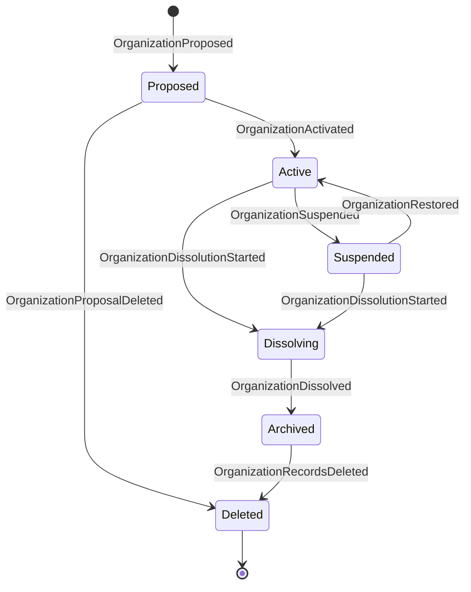

- Organization bootstrap is a one-time reserved genesis transition admitted directly under the Constitution because no organizational Grant yet exists. A verified Human initiates one atomic transaction establishing the Organization, Human Actor, constitutional owner or governor Role, Human Role Assignment, founding constitutional Decision, initial Grants, recording Command, founding Events, and Audit Record references. No partial state or ordinary operational work is legal. Exact retries are idempotent; competing attempts deterministically resolve or reject; and the exception ends with successful establishment.
- `Proposed -> Active`, mission or governance change implicit in activation, and every transition to `Dissolving` are Human-reserved. Initial activation occurs only as the final state of a complete bootstrap transaction; later transitions follow ordinary rules.
- `Active -> Suspended` is Authorized only for eligible human governance or emergency safety control; emergency use requires Incident review.
- `Suspended -> Active` is Human-reserved and requires documented remediation.
- `Dissolving -> Archived` is Human-reserved and requires legal, commitment, asset, records, and retention checks.
- Deletion is Human-reserved and permitted only for an unactivated proposal or after dissolution, retention expiry, legal-hold clearance, dependency review, and lawful tombstone creation. An active Organization cannot be deleted.

## 3. Role

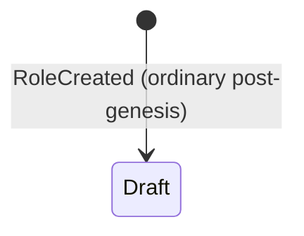

- `[nonexistent] -> draft` is the sole legal initial transition for an ordinarily created post-genesis Role.
- Ordinary Role creation MUST NOT transition directly to `active`. Activation is a separate governed action and requires an explicitly admitted transition; this section does not authorize or define its future preconditions.
- Every other unspecified Role transition remains rejected under the common transition rule.
- The constitutional owner or governor Role established within the atomic bootstrap transaction is a distinct reserved genesis establishment. It is not an ordinary `RoleCreated` transition and MUST NOT be recreated after genesis.

## 4. Employee

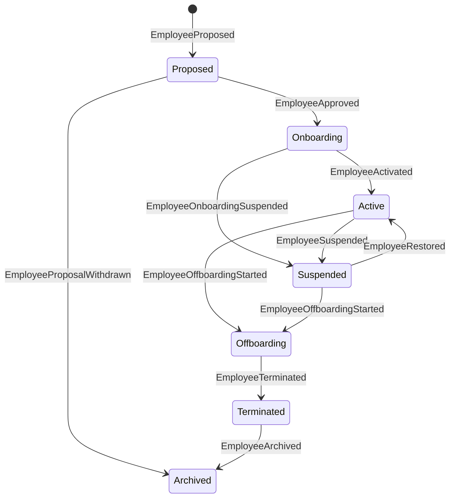

- Creation of an Employee—the Constitution's AI Employee—is Policy-required. Hiring, dismissal, compensation, or surveillance of a Human is governed through the Human's organizational relationship and is Human-reserved where the Constitution, law, or Policy requires; Humans do not become Employee entities.
- Activation requires an active Role assignment, supervisor or governance owner, escalation path, budget, and Authority Grant. Onboarding grants no operational authority.
- Suspension is Authorized under the emergency rule or Policy-required otherwise. It suspends employee Grants and sponsored workers unless a narrower safe disposition is explicitly recorded.
- Restoration is Policy-required and requires Incident or suspension review, eligible authority, and refreshed Grants.
- Offboarding is Policy-required for Employees. Ending a Human employment relationship is separately Human-reserved where applicable. Termination revokes Grants, credentials, active assignments, and worker sponsorship after safe handoff.
- Employee identity and attribution are never deleted; archival preserves continuity records.

## 5. Temporary Worker

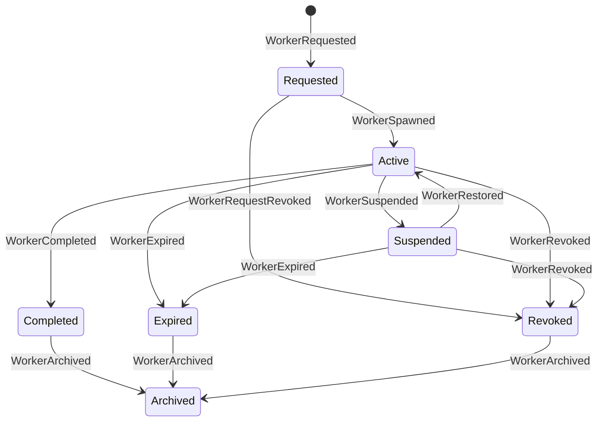

- `Requested -> Active` requires express Sponsor delegation, one purpose, eligible Tasks, a resource ceiling, Tool bounds, complete attribution, and an active Grant no broader or longer than the Sponsor's delegable authority. A3 authority requires specific Human approval; A4 is prohibited.
- Suspension and revocation are Authorized for the Sponsor, Grant Issuer, eligible Human, or safety control. Sponsor suspension automatically suspends the worker.
- Restoration is Policy-required and cannot occur while the Sponsor or worker Grant is inactive.
- Completion is Authorized when the completion condition is evidenced. Expiry is Automatic at the earliest time or condition. Neither can be extended retroactively; new work requires a new worker or authorized new grant before expiry.
- Terminal states cannot return to active. Archival occurs only after result handoff, resource reconciliation, and credential revocation.
- Expiry, completion, revocation, and archival end operational availability but never delete or reuse the worker's persistent Actor identity. Historical Events, Decisions, Artifacts, and Audit Records MUST continue to resolve it.

## 6. Goal

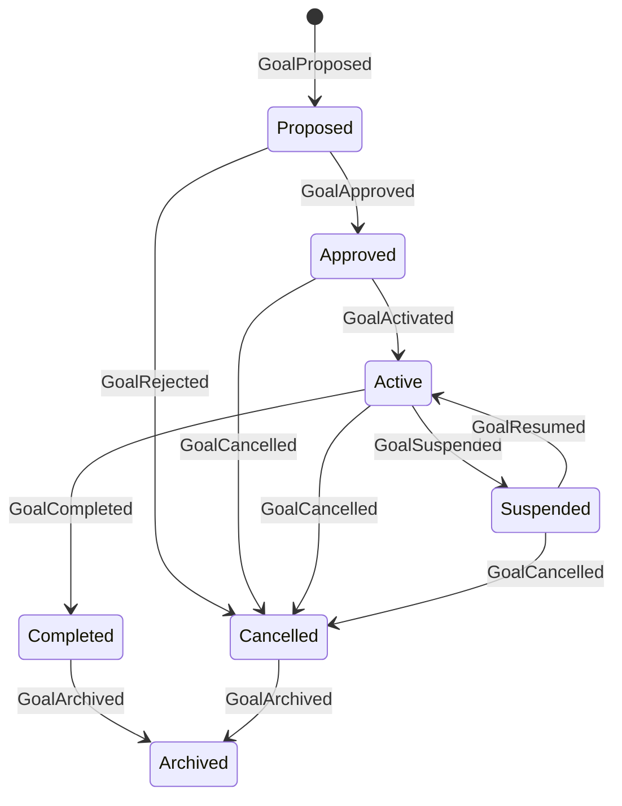

- Approval is Policy-required and must verify issuer authority, mission or duty trace, legality, success evidence, resource bounds, and conflict with higher rules.
- Activation is Authorized after approval and required resource reservations.
- Suspension is Authorized for stop conditions, budget exhaustion, authority loss, material uncertainty, conflict, or Incident. Resume is Policy-required after the cause is resolved.
- Completion requires an authorized Decision based on pinned evidence satisfying current success criteria. Where completion is an A4 or Human-reserved A3 disposition, the accountable decider is an eligible Human or valid Human Governing Body process; every separately required Approval must also be present.
- Cancellation is Policy-required and must account for commitments, dependent Tasks, Resources, Artifacts, and records. Completed and cancelled Goals cannot reactivate; materially renewed work creates a new Goal.

## 7. Task

Task lifecycle does not require a Project, Objective, or Plan. Those are optional planning structures, and a Task may attach directly to its Goal or duty Work Root. Schedules and assignments may be proposed by Employees, planners, workflow services, or organizational processes; the kernel admits Commands and enforces valid transitions but does not choose scheduling strategy.

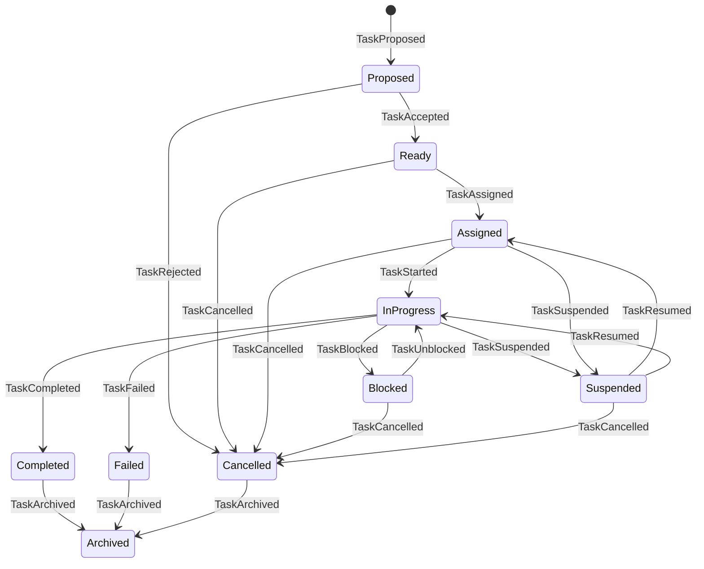

- Acceptance requires exactly one Work Root: either one active `goal_id` or one complete `duty_reference`, never both or neither. A duty reference identifies duty type, governing Policy, constitutional provision, Incident, compliance obligation, or maintenance mandate, accountable issuer or owner, scope, and review or completion condition. Acceptance also requires bounded outputs and criteria, risk and reversibility classification, authority requirement, and resource limits.
- Assignment is Authorized only to an eligible active Actor or Role and never transfers authority. Start requires the assignee's active Grant and required Approvals.
- Blocking reports an unmet dependency; suspension prevents new work due to governance, safety, authority, Policy, or resource conditions. Resume is Policy-required when suspension arose from an Incident, revocation, expired Approval, or safety control; otherwise it is Authorized after revalidation.
- Completion requires result evidence and acceptance-criteria evaluation; consequential outputs require the Decision and Approval specified by Policy. Failure records attempted work and effects.
- Cancellation is Policy-required when commitments or external effects exist; otherwise Authorized by the Goal owner. Terminal Tasks do not reopen. Retry is a new Task or an explicitly modeled attempt under the same still-active Task.

## 8. Approval

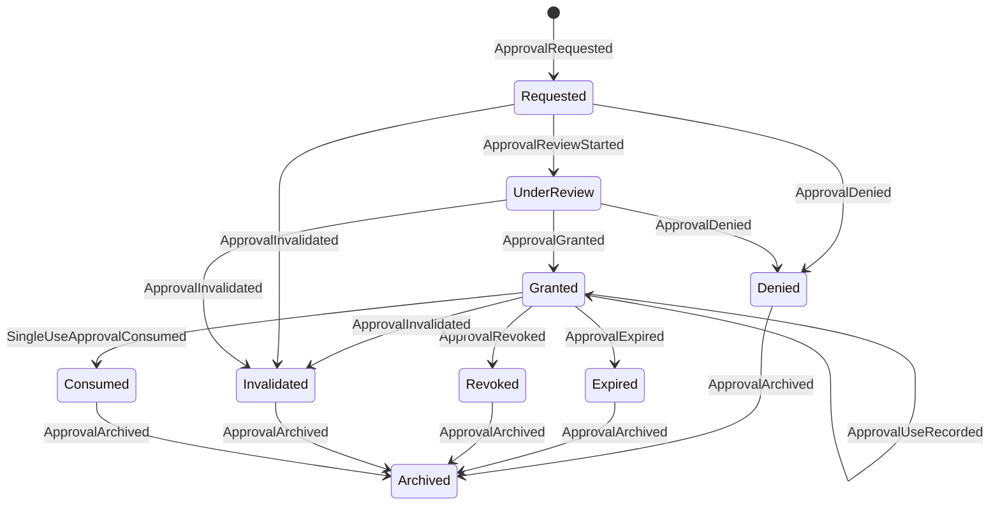

- A request requires exactly one recorded Decision, exact requested disposition, alternatives, evidence, benefit, cost, risks, reversibility, eligible approver route, and proposed `approval_mode`. Every granted Approval records `used_count`, effective and expiry conditions, conditions, revocation triggers, and applicable action, Resource, risk, and budget scope.
- Only an eligible Actor whose authority covers the Approval disposition may grant or deny. The approver is distinct from the Decision's accountable decider even when one eligible Human fills both roles. Self-approval of A3 is prohibited unless a narrow explicit low-risk Policy permits it; A4 always requires responsible Human authority for both the accountable Decision and every separately required Approval.
- Grant requires an informed, specific disposition before execution. Denial and nonresponse confer no authority.
- A `single_use` Approval has an effective usage limit of one and transitions to `consumed` when its one authorized execution is recorded, then to archival. A `bounded_repeat` Approval requires a positive `usage_limit` and remains granted only until that limit, expiry, revocation, invalidation, or another condition is reached. Each use increments `used_count` atomically.
- A `standing` Approval requires a review schedule and applies only to a narrowly defined recurring class of A2 activity expressly permitted by Policy. It MUST NOT authorize A4 matters or broadly authorize unspecified A3 actions.
- Every use is independently attributable and rechecked against current Authority, Policy, budget, Decision assumptions, scope, risk, Resources, conditions, and revocation triggers. Approval remains distinct from Authority.
- Expiry and satisfaction of a use limit are Automatic. Revocation is Authorized by the approver or superior eligible authority. Material change to scope, cost, risk, evidence, assumptions, Policy, `decision_content_version`, or recurring action class invalidates the Approval automatically.
- A bounded or standing Approval may be archived only after expiry, revocation, invalidation, or authorized retirement; its uses, effect, and evidence remain auditable.

## 9. Authority Grant

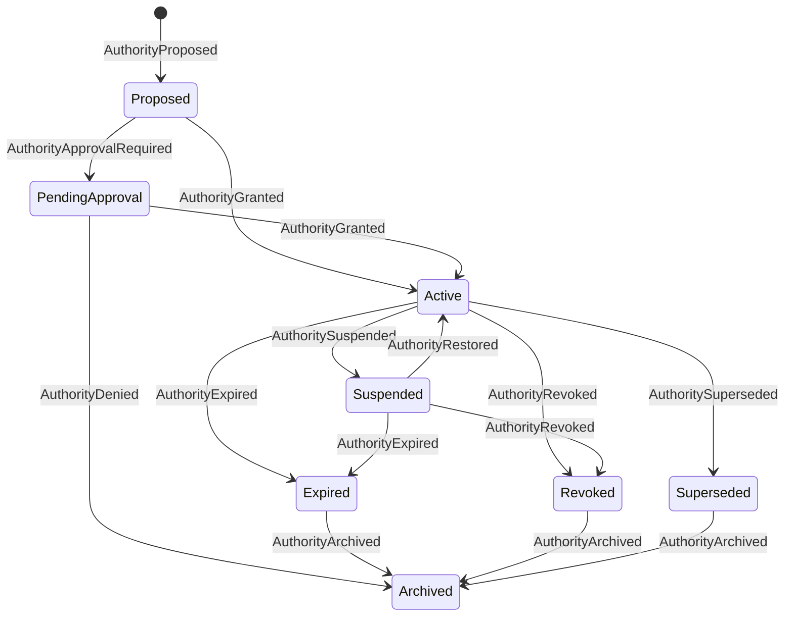

- Activation requires exactly one eligible Issuer, one recipient, complete scope and constraints, valid parent authority for delegation, and all Policy-required Approvals. The underlying Grant disposition requires an eligible Human accountable decider for A4 and Human-reserved A3 matters; every separately required Human Approval is additional and does not supply that deciding authority.
- A Grant is usable only between its effective and expiry conditions while `active`. Silence, pending state, suspension, expiry, or nonresponse denies authority.
- Suspension is Authorized under emergency rules or by the Issuer or superior authority. Restoration is Policy-required and must revalidate issuer authority, recipient, scope, conditions, Policy, Approvals, budgets, and Incident remediation.
- Expiry is Automatic and irreversible. Revocation is Authorized by the Issuer or superior eligible authority and prevents new actions. Supersession requires a new valid Grant; it cannot rewrite the old Grant.
- Expansion, later expiry, broader resources, higher risk, or added delegation creates a new Grant and requires fresh approval as applicable.

## 10. Incident

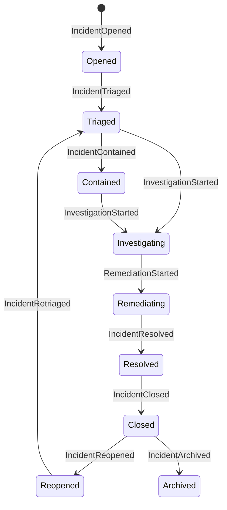

- Any Actor MAY submit an Incident Command; the kernel records it if attributable and minimally well formed. Opening does not imply the report is proven.
- Triage assigns severity, affected scope, containment owner, and review authority. Credible imminent harm permits immediate containment before triage completion.
- Containment actions require emergency or ordinary authority and must be limited to preventing harm, preserving evidence, notifying accountable Humans, and protecting assets.
- Resolution requires documented cause or acknowledged uncertainty, impact, remediation evidence, unresolved risk, and follow-up. Closure is Policy-required and must be performed by an eligible reviewer independent enough for severity.
- Reopening is Authorized on new evidence, recurrence, failed remediation, or audit finding. Archival is permitted only after closure, required notifications, Tasks, legal holds, and reviews are complete.

## 11. Memory Record

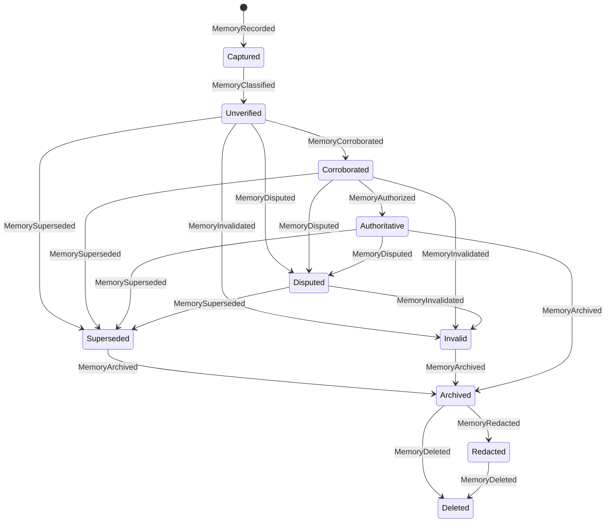

- Capture requires provenance, organization, creator, source, acquisition method, kind, validity, classification, retention, evidence, and confidence. Unknown provenance is explicit and cannot become authoritative without adequate validation.
- Corroboration and authoritative designation are Policy-required and evidence-based. Repeated output derived from the same source is not independent corroboration.
- Dispute, invalidation, and supersession preserve original content and provenance and link the contradictory or replacement records. Supersession never silently mutates a Record.
- Archival follows retention Policy and active-use checks. Redaction or deletion requires valid authority, purpose, scope, dependency, legal-hold, audit-impact, and propagation checks. Human approval is required when Policy or law reserves it.
- Deletion leaves a nonreconstructive tombstone and later deletion Event and never conceals wrongdoing or silently rewrites immutable Event history. Sensitive or erasable content SHOULD normally be held behind stable governed references. Redaction, sealing, access restriction, or cryptographic erasure MAY make that content unavailable when Policy or law requires, while replay deterministically preserves the availability state and never re-exposes removed content.

## 12. Artifact

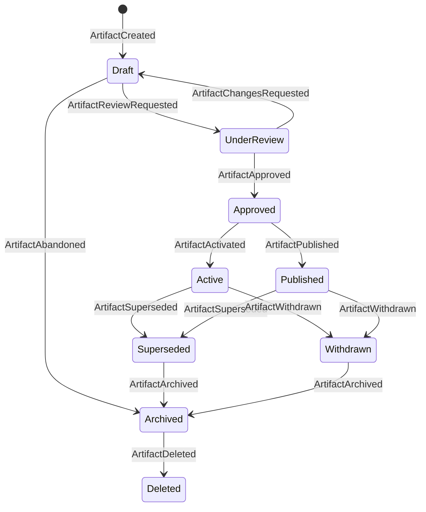

- Creation requires one owner, creator, custodian, source Task or duty, provenance, classification, integrity reference, and `artifact_content_version`.
- Review and approval requirements depend on risk, publication, external commitment, protected data, rights, safety, and Policy. Public, binding, rights-affecting, or irreversible publication requires the applicable consequential Decision and Approval.
- Activation makes an internal Artifact current; publication creates an external effect and is not presumed reversible.
- Material changes produce a new `artifact_content_version` and may invalidate Approval. Supersession links content versions without destroying history. Withdrawal records ongoing obligations and cannot guarantee recall of disclosed copies.
- Deletion is Policy-required and allowed only after ownership, retention, dependency, licensing, legal-hold, Incident, and audit checks. Required tombstones and Events remain.
